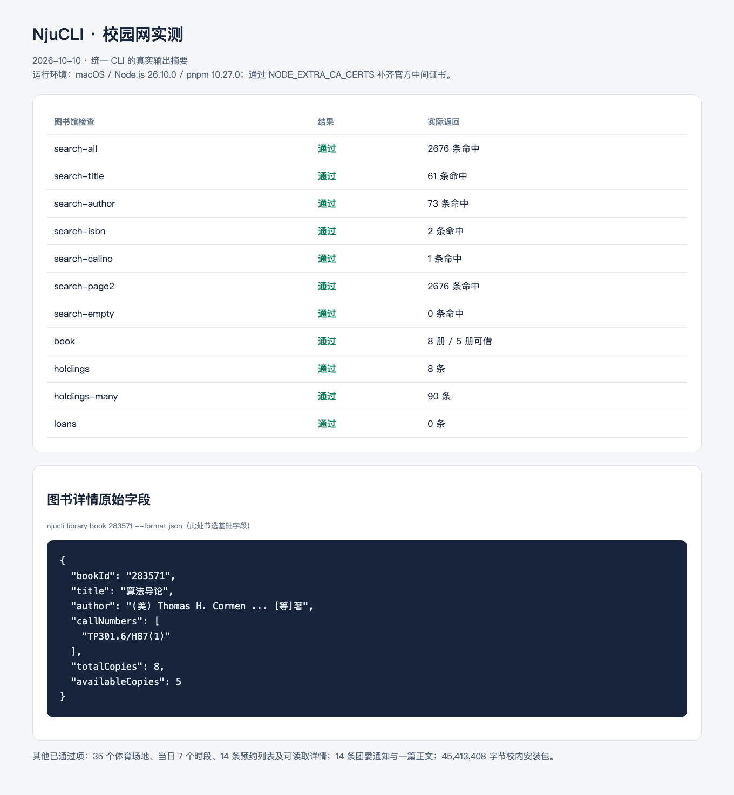
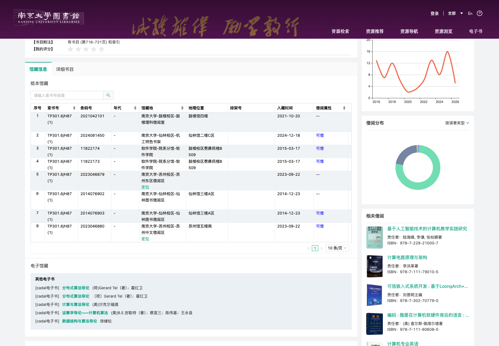

# 校园网验证与校医院接入评估

验证日期：2026-10-10（Asia/Shanghai）。环境：校园网、macOS、Node.js 26.10.0、pnpm 10.27.0。工作在独立 Git worktree 中进行，基于最新 `main` 的认证后台修复提交 `157f436`。

本轮完成图书馆实网修复，补齐体育、团委和校内软件下载的查询证据，并确认校医院独立接入的入口、认证链路与菜单范围。远端操作范围为查询、登录及本地下载。报告与截图使用公开书目、官网页面及脱敏结果；个人预约标识、身份资料和会话保存在本地临时目录。

## 图书馆

### 发现与修复

| 实网现象 | 原因与处理 | 验证结果 |
| --- | --- | --- |
| 校园网能打开 OPAC，旧 CLI 在 WebVPN 跳转处报 `ENOTFOUND vpn.nju.edu.cn` | 书目与馆藏改为直连 `https://opac.nju.edu.cn`；读者认证依赖 SSO | 公开查询成功，借阅调用使用当次读者会话 |
| 官网请求使用 `/find/`，原实现采用 `/meta-local/opac/` | 按南大官网实际请求替换检索、详情、馆藏和借阅契约 | 11 项统一 CLI 实网检查通过 |
| 搜索索引里的册数与官网刷新值存在差异 | 按官网调用 `getPItemAndOnShelfCountAndDuxiuImageUrl` 批量刷新数量 | 《算法导论》为 8 册、可借 5 册，与馆藏逐册结果一致 |
| 图书馆登录回跳后，由网页脚本写入读者 Cookie | 登录等待 Cookie 就绪，再回读 `/oga/userinfo`；后续从同一会话携带 `jwtOpacAuth` | 手动登录、跨进程状态和借阅查询通过 |
| Node.js 报证书链校验失败 | 学校站点只提供叶子证书；从 DigiCert 官方补齐中间证书 | 以 Node 自带根证书验证签发链为 `OK`，HTTPS 校验保持启用 |

本轮所有 Node 图书馆实网检查均在启动进程时设置 `NODE_EXTRA_CA_CERTS`，指向已核对的中间证书。具体配置见[HTTPS 配置](../../skills/njucli-library/references/network.md)。这是当前服务端证书链对应的运行前提。

### CLI 结果

下列参数接在 `node dist/cli.js library` 后，输出均使用 `--format json`，退出码均为 0。

| 参数 | 实际结果 |
| --- | --- |
| `search 算法导论 --page-size 2` | 总命中 2676 条；返回 2 条 |
| `search 算法导论 --field title --page-size 2` | 总命中 61 条 |
| `search 科尔曼 --field author --page-size 2` | 总命中 73 条 |
| `search 978-7-111-40701-0 --field isbn --page-size 2` | 总命中 2 条 |
| `search TP301.6/H87(1) --field callno --page-size 2` | 总命中 1 条 |
| `search 算法导论 --page 2 --page-size 2` | 返回第二页 2 条，第一页首项为 `283571` |
| `search njucli-acceptance-no-such-title-20261010 --field title --page-size 2` | `total: 0`、`items: []` |
| `book 283571` | 《算法导论》，8 册馆藏、5 册可借 |
| `holdings 283571` | 8 条逐册馆藏，包含馆藏地、索书号与状态 |
| `holdings 2714143` | 逐页读取 90 册，覆盖 9 页 |
| `loans` | 当前账号返回空列表；认证回读有效 |

完整的脱敏命令摘要见[结果 JSON](assets/2026-10-10/library-results.json)。当前账号的正数借阅和自然逾期案例留待有对应数据时核对；借阅字段、过期令牌响应、日期判断与多页馆藏已由本地集成用例覆盖。

独立 `skills/njucli-library/scripts/run.mjs` 的检索、馆藏和借阅查询已通过。统一 CLI 与独立 Skill 的 MCP 分别调用 `library_search`、`library_holdings`，共 4 次实网工具调用均返回成功。`auth login opac` 返回 `valid`，独立进程的 `auth status opac` 再次返回 `valid`。

另在临时账号目录保留 SSO、清空 OPAC Cookie，核对读者状态先为 `expired`；随后借阅调用自动完成 OPAC 登录并返回空列表，新会话再次探测为 `valid`。该检查使用独立浏览器目录，结束后清理临时账号。

以下为真实 CLI 输出的排版截图：

官网检索页：

官网逐册馆藏页：

## 其他内网验证

| 能力 | 本轮执行 | 结果与范围 |
| --- | --- | --- |
| 体育场地 | `sports venues`、`sports venue 131` | 35 个场地；指定场地为鼓楼健身房 |
| 体育时段 | `sports slots --venue-site 131 --date 2026-10-10` | 7 个时段，包含 `available` 与 `unavailable` |
| 体育预约 | `sports bookings --page 0 --size 20` | 14 条预约列表 |
| 体育详情 | 使用列表内记录调用详情 client、`sports booking`，并在官网点击“详情” | 一条 client 详情成功；官网实际提供详情按钮的记录在浏览器和 CLI 均成功；另两条记录被学校归属校验拒绝 |
| 团委通知 | `campus articles --source youth-league --section notifications --page 1` | 14 条通知，`nextPage: 2` |
| 团委正文 | 从列表取 `articleId` 调用 `campus article` | 正文读取成功 |
| 软件目录 | `software show mathtype` | 返回两份官方安装包 |
| 校内完整下载 | `software download mathtype mathtype/MathType-win-en-7.8.2.441.exe --output …` | 45,413,408 字节；Windows PE 安装包；文件权限 0600 |

体育详情仍使用官网的 `GET /api/orders/{id}`；官网订单组件调用同一路径，且列表中的部分记录具有“详情”按钮。两条受限记录的原始消息为“操作失败，您只能操作自己的订单”。本次记录其远端权限结果，CLI 继续按统一错误格式返回。

## 校医院

### 官方入口

| 入口 | 用途 | 本轮证据 |
| --- | --- | --- |
| [医院官网](https://hospital.nju.edu.cn/) | 公告、科室、工作时间、就诊流程、专家门诊等 | 校园网 HTTP 200，浏览器页面与“自助服务”链接已核对 |
| [医院自助服务](https://ndyy.nju.edu.cn/zzfw/) | 师生自助业务 | 登录页有统一身份认证入口 |
| `https://ndyy.nju.edu.cn/zzfw/asLogin.aspx` | 统一认证交接 | 复用现有 SSO，最终 HTTP 200 到达 `/zzfw/Pages/Default.Aspx` |
| `/zzfw/ashx/PageInit.ashx` | 登录后菜单 | 返回 `homeInfo/logoInfo/menuInfo`，菜单与浏览器一致 |

医院官网截图：

自助平台登录页：

登录后预约菜单截图，仅截取业务导航：

### 接入判断

**可以按现有架构设计独立的 `njucli-hospital` Skill。** 官网和自助平台有明确边界，统一身份认证已完成真实交接，菜单能通过 HTTP 获取；认证模块可新增 SSO 派生的 `hospital` capability，业务方法和请求归该 Skill 的 client。

| 功能组 | 已确认入口 | 后续实现所需证据 |
| --- | --- | --- |
| 公共就医信息 | 官网工作时间、科室、就诊流程、专家门诊与通知 | 各栏目正文、表格字段和更新日期；适合作为首批查询能力 |
| 预约项目 | `SelfHelp/AppointmentTask.Aspx`，包括体检、疫苗、急救课程、活动和结核筛查 | 可预约项目、日期、余量、本人已有预约的查询响应；提交和取消需指定项目及动作 |
| 报告查询 | `SelfHelp/HealthReport.aspx`、`SelfHelp/HealthReportB.Aspx` | 本人授权的报告列表、标识、下载格式及归属核对 |
| 大学生医保 | `SI/MyInfo.aspx`、`SI/MySI.aspx`、`SI/MySIUnPay.aspx`、`SI/MyDifficult.aspx` | 查询字段与所需身份；申请类操作的表单、提交与回读契约 |

本轮医院验收终点为认证成功和菜单读取。上述业务页面属于已发现的入口；业务读取与写入能力在对应接口验证后接入。首批建议聚焦公开就医信息、可预约项目及本人预约查询，沿用 `njucli hospital <command>`、独立 Skill 入口和只读 MCP 的现有组织方式。

## 本地与安装验证

`pnpm install --frozen-lockfile`、`pnpm lint`、`pnpm test` 已通过，37 项本地集成全部通过。新增用例覆盖真实 client、命令及服务的组合，使用本机 HTTP 和合成数据；覆盖五种字段映射、实时数量、跨页馆藏、受保护借阅、登录后的 Cookie 等待、会话探测、错误输出脱敏。既有独立 Skill 用例继续验证 12 个 Skill 的单目录运行、声明依赖和 91 个只读 MCP 工具的一致性。

`npm pack --dry-run` 已核对发布清单；实际 tarball 安装到临时目录后，已通过 `njucli --help`、`campus sources --format json` 和题名检索《算法导论》（61 条，返回 2 条）。独立安装的图书馆查询使用上述中间证书配置。发布清单包含验证报告、截图和 Skill 内的 HTTPS 配置说明。
